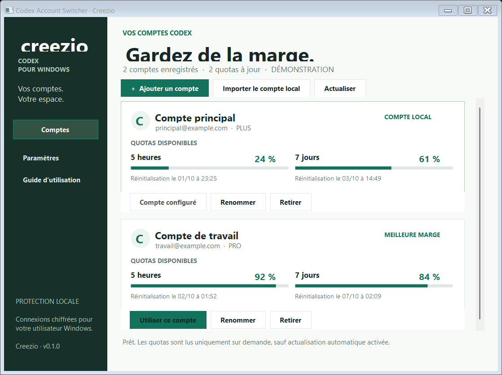
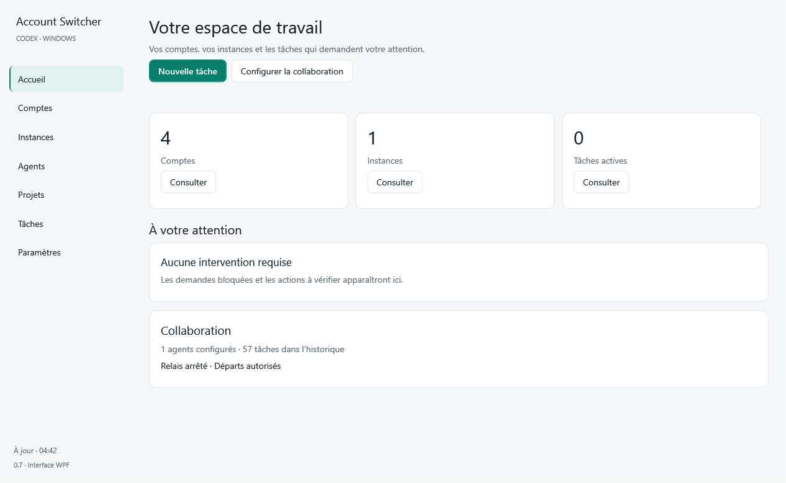
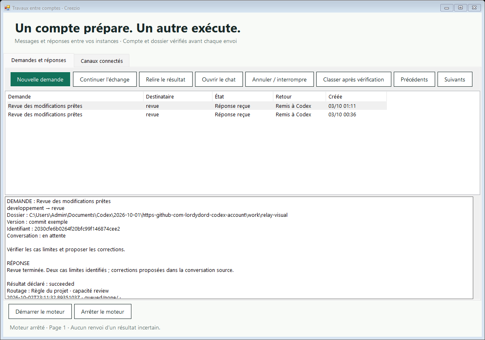
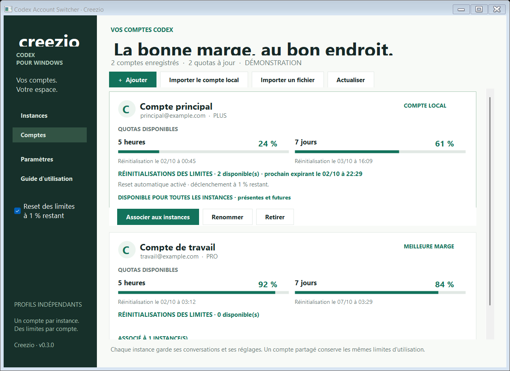

# Codex Account Switcher pour Windows

Une application native pour gérer plusieurs instances Codex en parallèle,
associer vos comptes à vos espaces, suivre leurs limites et transmettre des demandes entre comptes. Développée par **Creezio**.

**Version 0.9.0-beta.2 — instances nommées et préparation automatique.** Windows 10/11 x64, interface en
français et livraison portable incluant le runtime .NET 10, sans droits administrateur.

[Télécharger les versions Windows](https://github.com/creezio/codex-account-switcher-windows/releases)
· [Versions et téléchargements](https://github.com/creezio/codex-account-switcher-windows/releases)
· [Plan de réalisation](docs/PLAN.md)
· [Validation](docs/VALIDATION.md)



## Relais entre comptes

Créez une instance, donnez-lui un nom et connectez son compte permanent.
Dans un nouveau chat Codex, dites par exemple : **« Relis ces fichiers et délègue
la vérification à Léa »**. Le plugin connecte le chat automatiquement, transmet la
mission à l'instance nommée et retourne son résultat dans le chat source.

Le plugin et les skills sont installés lors de la création, vérifiés au démarrage
puis toutes les 5 minutes par défaut (intervalle réglable). Le switcher doit rester
ouvert, éventuellement près de l'horloge. Les réglages de canaux, projets et règles
restent dans **Réglages avancés**, sans être requis pour une mission explicite.
[Parcours, plan et validation 0.9](docs/SIMPLE-INSTANCES.md).

Une instance entièrement neuve doit avoir reçu un premier message dans Codex.
Les permissions restent propres à chaque chat ; le relais ne les modifie pas.
Les anciens chats peuvent conserver l'ancien plugin jusqu'à un nouveau chat.





## Nouveautés 0.8

Envoi de prompts depuis le switcher vers un chat nouveau ou existant, partage
entre PC Windows par TLS avec invitations révocables, lecture des conversations
autorisées et demandes d'assistance configurables avec retour au chat source.
Les échanges utilisent les fenêtres Codex ouvertes. Aucun adaptateur Cursor CLI
n'est livré. [Guide et limites de la bêta](docs/WINDOWS-CONSOLE.md) ·
[Résultats de validation](docs/WINDOWS-CONSOLE-VALIDATION.md).

## Nouveautés 0.7

Navigation synchronisée avec la page affichée, thèmes clair/sombre/système,
listes avec fiches détaillées, actions regroupées et réglages protégés contre
la perte de brouillons. Recherche réactive, pagination filtrée et erreurs visibles.
L'accueil signale les interventions requises. Les outils de configuration,
modèles, espaces Git et diagnostics sont intégrés à la nouvelle interface.

[Réalisation, migration et tests 0.7](docs/UI-VALIDATION.md).

## Fonctions introduites en 0.6

Vue d'ensemble, premiers pas, configuration guidée, modèles facultatifs et
simulation sans envoi. Recherche et filtres des travaux, pause des départs,
arrêt progressif, concurrence par compte, retours groupés ou manuels et attente
explicite des sous-tâches. Supervision des limites indépendante de la fenêtre,
politique par compte, historique des resets et réinitialisation manuelle.
Espaces Git autorisés, empreintes de fichiers, index de l'historique, diagnostic
expurgé et vérification des versions publiées.

[Parcours et qualification de la version](docs/PRODUCT-VALIDATION.md).

## Fonctionnalités

- Relais local : nouvelles conversations, réponses automatiques et poursuite dans le même chat.
- Moteur séparé de la fenêtre, file persistante et arrêt manuel conservé.
- Plugin intégré : trois skills et seize outils MCP, installation par profil et mise à jour idempotente.
- Délégation explicite par défaut ; routage selon les règles de chaque utilisateur.
- Ressources liées à leurs canaux autorisés, limites par compte, dépendances et concurrence bornée.
- Contrôle des permissions du nouveau chat avant transmission du travail ; réutilisation de chats terminés configurable.
- Réponses longues paginées, résultat déclaré distinct de la livraison, reprise sans renvoi aveugle.
- Contrôle des comptes, dossiers et permissions effectives ; historique chiffré et protection contre les envois répétés.
- Création d'instances nommées, avec authentification, interface, réglages et bases séparés.
- Un compte permanent par instance ; changement de compte et dissociation refusés. Un même compte peut être utilisé dans plusieurs instances explicitement créées pour lui.
- Ouverture simultanée, nom de l'instance dans le titre de sa fenêtre et fermeture ciblée.
- Instances retrouvées au redémarrage du switcher ; quitter le switcher les laisse ouvertes.
- Archivage réversible : les profils et les conversations sont conservés.
- Ajout de comptes avec la connexion officielle Codex dans votre navigateur.
- Import du compte présent dans le fichier local `auth.json`.
- Coffre chiffré avec Windows DPAPI, lié à votre utilisateur Windows.
- Quotas par compte et par catégorie : pourcentage restant, durée et date de
  réinitialisation. Une donnée inconnue reste inconnue.
- Comparaison des marges d'utilisation récentes depuis les fiches de comptes.
- Association initiale avec écriture atomique ; détection d’un compte changé manuellement dans Codex.
- Icône près de l'horloge, actualisation automatique facultative toutes les
  cinq minutes et notifications lorsque les quotas deviennent faibles.
- Noms personnalisés et retrait des comptes non associés à une instance.
- Affichage des crédits de reset disponibles et de la prochaine expiration connue.
- **Reset automatique facultatif des limites**, avec seuil et fenêtre configurables par compte (1 % proposé). Les réglages existants sont conservés ; une nouvelle installation exige une activation. Il concerne les
  comptes utilisés : session habituelle et instances gérées ouvertes. Un même compte
  est contrôlé une seule fois par minute, même lorsqu'il est partagé entre plusieurs instances.

## Installation

1. Téléchargez le ZIP depuis [Releases](https://github.com/creezio/codex-account-switcher-windows/releases).
2. Décompressez-le dans un dossier de votre choix.
3. Lancez **CodexAccountSwitcher.exe**. Conservez **tout le contenu du ZIP**, dont les DLL du runtime, fichiers JSON et le dossier `plugins`.
4. Pour une mise à jour, quittez d'abord l'ancien switcher via son icône près de
   l'horloge : fermer sa fenêtre le réduit seulement. Gardez les fenêtres Codex
   ouvertes. Les données sont relues à leur emplacement actuel. Pour déplacer
   le chemin d'une intégration, réinstallez-la depuis le nouveau dossier.

Windows 10/11 x64 avec **.NET Framework 4.8** pour le relais est requis. Le runtime
**.NET 10** de la fenêtre est fourni dans le ZIP. Le programme utilise
**Codex CLI** : la version fournie par l'application Codex est recherchée dans le
`PATH` et `%LOCALAPPDATA%\OpenAI\Codex\bin`. Sinon, sélectionnez votre `codex.exe`
dans **Paramètres**. Les lanceurs npm `.cmd` ne sont pas acceptés ; sélectionnez
le véritable exécutable fourni par votre installation.

L'ouverture des instances exige également l'application de bureau **Codex installée
depuis le Microsoft Store**, pour l'utilisateur Windows courant. L'installation est
partagée ; le switcher ne copie pas l'application et ne télécharge aucun SDK.

Le binaire de cette première version n'est pas signé avec Authenticode. Le code
source, les tests et les sommes SHA-256 sont publiés pour inspection.

## Utilisation

### Enregistrer les comptes

**Importer la session actuelle** copie la connexion du dossier Codex configuré vers
le coffre chiffré. Le fichier actif n'est pas modifié.

**Ajouter un compte** ouvre le parcours officiel de connexion dans votre
navigateur. Choisissez le compte souhaité. Pour reconnecter un compte expiré,
ajoutez de nouveau ce même compte : son entrée et son nom sont conservés.

Cliquez sur **Actualiser les limites** pour obtenir les quotas. Les anciennes valeurs sont
conservées avec un avertissement si une requête échoue. Les recommandations
excluent les valeurs datant de plus de dix minutes et les comptes en erreur.

### Créer et utiliser plusieurs instances

1. Dans **Comptes**, ajoutez les comptes souhaités ou importez leur fichier `auth.json`.
2. Dans **Instances → Créer une instance**, choisissez un nom, par exemple Travail.
3. Dans **Comptes → Associer aux instances**, autorisez le compte pour tous les espaces
   ou cochez uniquement ceux qui doivent le proposer.
4. Dans la carte de l'instance fermée, choisissez un compte et cliquez sur
   **Associer ce compte**, puis **Ouvrir l'instance**.
5. Vous pouvez aussi ouvrir une instance vide, vous connecter dans Codex et cliquer
   sur **Importer sa connexion**. Un nouveau compte ainsi importé est associé à cet espace.

Un changement de compte exige uniquement la fermeture de l'instance concernée.
**Fermer** demande confirmation puis ferme sa fenêtre et ses processus : ses tâches
en cours seront interrompues. Les autres instances restent ouvertes. **Archiver**
masque un espace fermé sans supprimer ses données ; **Afficher / masquer les archives** permet de le restaurer.

La **Session habituelle** représente le dossier Codex préexistant. Le switcher ne la
ferme et ne la relance jamais. Sa bascule reste conservatrice : elle exige la fermeture
de tous les clients Codex/ChatGPT et CLI connus, comme dans les versions précédentes.
Le compte affiché est celui du fichier du profil ; il ne prouve pas l'identité déjà
chargée en mémoire par une application externe.

Les associations définissent les comptes proposés par le switcher. Ce ne sont pas
des permissions Windows : un utilisateur ayant accès au dossier peut se connecter
directement dans Codex. Le même compte dans deux instances **partage ses quotas**.



**Paramètres → Restaurer la connexion précédente** concerne la session habituelle.
Chaque instance gérée possède aussi sa propre sauvegarde transactionnelle chiffrée.

Fermer la fenêtre conserve l'icône de notification. Pour arrêter le programme,
faites un clic droit sur cette icône puis **Quitter**.
Quitter le switcher laisse les instances Codex ouvertes. Le suivi des limites
continue seulement si la supervision indépendante est activée dans Paramètres.
Installez la mise à jour dans son dossier de livraison ; ne remplacez pas un
exécutable utilisé par une instance ou un serveur MCP.

### Réinitialisation automatique des limites d'utilisation

L'application lit les **crédits de réinitialisation gagnés**, distincts du solde
de crédits d'utilisation achetés. Si une fenêtre du quota `codex` d'un compte utilisé
atteint le **seuil configuré (1 % proposé)** et qu'une réinitialisation compatible
est disponible, et si sa politique autorise l'automatisme, elle
demande automatiquement un reset via `account/rateLimitResetCredit/consume`.
Cela fonctionne pendant que Codex est ouvert et ne nécessite aucun changement
de compte ni redémarrage de Codex.

- Enregistrez le compte dans le coffre et autorisez-le pour l'instance concernée.
  Les comptes uniquement configurés dans des instances gérées fermées ne déclenchent
  aucun reset. Une utilisation simultanée ne crée pas de demandes supplémentaires.
- Le contrôle démarre à l'ouverture du switcher et se répète toutes les **60
  secondes**, y compris lorsque sa fenêtre est masquée. L'actualisation de tous
  les comptes toutes les cinq minutes reste une option séparée. Il ne s'agit pas
  d'un service Windows : le processus indépendant facultatif assure la continuité
  après fermeture. Une connexion réseau ou une authentification indisponible
  empêche un reset.
- La mesure exacte est utilisée : avec un seuil de 1 %, 1,4 % ne déclenche pas
  un reset ; 1 % et 0 % oui.
  Le serveur décide si la fenêtre est effectivement éligible.
- Les crédits connus expirant le plus tôt sont prioritaires. Les crédits expirés,
  déjà utilisés ou d'un type inconnu sont exclus. Lorsque seul le nombre est
  fourni, Codex choisit le crédit. Un nombre inconnu ne vaut jamais un crédit disponible.
- Chaque demande possède un identifiant enregistré **avant** son envoi dans le
  coffre. En cas de coupure réseau ou de redémarrage, au plus trois tentatives
  espacées d'une minute réutilisent exactement cet identifiant et le même crédit.
  Elles représentent une seule consommation idempotente, pas trois resets.
- Après acceptation, les quotas et crédits sont relus. Aucune nouvelle demande
  n'est créée tant que le rétablissement des fenêtres Codex n'a pas été observé.
  Un délai minimal de cinq minutes après le début du reset évite les enchaînements
  dus à un retard de propagation. Une réponse inconnue suspend les resets du compte.
- Si Codex répond `nothingToReset`, l'application attend que le quota change ;
  s'il répond `noCredit`, elle attend une nouvelle disponibilité.

L'automatisme est désactivé pour une nouvelle installation. Les réglages existants
sont conservés à la mise à jour. Chaque compte peut remplacer le choix global
depuis sa fiche. Aucune confirmation supplémentaire n'est demandée pour chaque
reset automatique autorisé par cette politique.

## Compatibilité et limites

- La bascule cible le stockage **fichier** de Codex : `CODEX_HOME/auth.json`, ou
  `%USERPROFILE%\.codex\auth.json` par défaut. `CODEX_HOME` est respecté et le
  dossier peut être choisi dans les paramètres.
- Les modes `keyring`, `auto` et `ephemeral` sont refusés pour la bascule et
  l'import local. Le switcher conserve les configurations existantes. Les installations
  gérées qui imposent un autre magasin de connexion ne sont pas prises en charge.
- Les quotas passent par `codex app-server` et son mode expérimental
  `chatgptAuthTokens`. Une version incompatible produit un état d'erreur, sans
  inventer des quotas. Version testée : voir [VALIDATION.md](docs/VALIDATION.md).
- La consultation des quotas ne renouvelle pas le refresh token copié. Les jetons
  plus récents d'un compte reconnu sont récupérés depuis ses profils vers le coffre,
  sans écrire dans une instance ouverte. Les instances restent des connexions Codex
  ordinaires ; une session expirée peut demander une nouvelle connexion.
- La bascule entre deux comptes réels dans l'application de bureau et le parcours
  OAuth complet demandent encore une recette interactive. Les tests automatisés
  couvrent les opérations locales avec des comptes fictifs.
- Pas de bascule automatique ni de reprise automatique des conversations.
- Le lancement multiple utilise `CODEX_ELECTRON_USER_DATA_PATH` et le mécanisme Windows
  [`Invoke-CommandInDesktopPackage`](https://learn.microsoft.com/en-us/powershell/module/appx/invoke-commandindesktoppackage).
  Ce mécanisme de diagnostic et le réglage interne Electron ne constituent pas un
  support multi-profil officiel de Codex. Une mise à jour peut changer leur comportement.
- Des erreurs réseau transitoires ont été observées au premier démarrage. Le switcher
  les signale sans modifier les politiques réseau ; rouvrir le profil a résolu le cas testé.
  Certaines intégrations système, notamment les raccourcis globaux, restent partagées.
- Les nouveaux profils désactivent `features.workspace_dependencies` pour éviter les
  téléchargements automatiques volumineux d'outils bureautiques. Le code et les terminaux
  restent disponibles. Ce réglage peut être réactivé explicitement dans leur configuration.
  Codex peut créer ses propres caches de plugins ; l'archivage conserve ces données.
- La consommation réelle d'un crédit n'a pas été effectuée comme test : le
  déclenchement et les cas d'échec sont validés avec un serveur simulé. La lecture
  réelle des crédits et des quotas est validée sur le compte local.

## Données et protection

Le coffre `accounts.dpapi` et les paramètres se trouvent dans
`%LOCALAPPDATA%\Creezio\CodexAccountSwitcher`. Ce dossier n'est accessible qu'à
l'utilisateur Windows courant et au compte système. Les noms, adresses et jetons
des comptes sont tous inclus dans le coffre chiffré. Il n'est pas portable vers un
autre utilisateur Windows.

Les profils gérés se trouvent sous `instances/<identifiant>/codex-home` et
`instances/<identifiant>/electron-profile` dans ce même dossier privé. Leurs fichiers
`auth.json` gardent le format requis par Codex. Les associations et sauvegardes sont
dans le coffre DPAPI v2 ; la première sauvegarde conserve également l'ancien coffre
chiffré `accounts-before-instances.dpapi`. Les versions antérieures refusent le format v2.

Pour la connexion officielle, le serveur Codex écrit temporairement sa connexion
dans un sous-dossier privé `runtime`. Ce serveur est isolé dans un Windows Job
Object : ses processus auxiliaires sont arrêtés à la fermeture. Le dossier de
travail est supprimé à la fin de l'opération ; un verrou Windows ou un arrêt
brutal peut nécessiter le nettoyage manuel des restes, après vérification que
l'application est arrêtée. Aucune collecte de télémétrie n'est ajoutée ; celle
des serveurs Codex temporaires est désactivée.

La protection DPAPI ne protège pas contre un logiciel malveillant exécuté sous
votre propre utilisateur Windows. Le fichier actif `auth.json` demeure au format
requis par Codex. Les conversations, projets, bases et réglages de Codex ne sont
pas déplacés ni supprimés.

## Compiler et tester

Depuis PowerShell à la racine du dépôt :

```powershell
.\scripts\build-desktop.ps1 -Portable -OutputDirectory outputs\v0.9.0-beta.2
.\scripts\test.ps1 -TestDirectory work\framework-validation
dotnet run --project tests\Core.Net10.csproj -c Release -- work\net10-validation
.\scripts\test-desktop.ps1 -BinaryDirectory outputs\v0.9.0-beta.2
```

La compilation de l'interface exige le SDK .NET 10 ; le moteur utilise le
compilateur C# de .NET Framework. Les packs de runtime sont téléchargés lors
de la première publication. Les sorties et tests réutilisent leurs dossiers.

Avec Codex CLI installé, vérifiez aussi le protocole isolé :

```powershell
.\scripts\test.ps1 -ProtocolSmoke
```

Le contrôle réel facultatif suivant lit les quotas du compte local, sans changer
de compte, renouveler ses jetons ni consommer de crédit de reset ; il ne publie
aucune identité ni valeur de quota dans les journaux :

```powershell
.\scripts\test.ps1 -LiveReadOnly
```

Le test de bureau facultatif ouvre puis ferme uniquement une instance de test. Il
requiert le paquet Microsoft Store et conserve le profil sous `work/instance-smoke`.
Pour tester un compte réel, ajoutez `-DesktopAuthFile` avec le chemin d'un fichier
de connexion que vous êtes autorisé à utiliser. Ces fichiers restent hors Git.

```powershell
.\scripts\test.ps1 -DesktopSmoke
```

Pour produire le ZIP portable :

```powershell
.\scripts\package-desktop.ps1 -SkipBuild
```

GitHub Actions compile l'application et exécute les tests hors ligne à chaque
push et pull request. Aucune connexion réelle n'est nécessaire dans la CI.

## Origine et licence

Le projet [lordydord/Codex-Account-Switcher](https://github.com/lordydord/Codex-Account-Switcher)
a inspiré les fonctions de cette application. Il s'agit d'une implémentation
Windows indépendante en C# ; aucun code Swift ni ressource graphique n'a été copié.

Documentation technique : [authentification Codex](https://learn.chatgpt.com/docs/auth)
et [Codex App Server](https://learn.chatgpt.com/docs/app-server).

Licence [MIT](LICENSE), © 2026 Creezio. Projet indépendant, non affilié à OpenAI.
