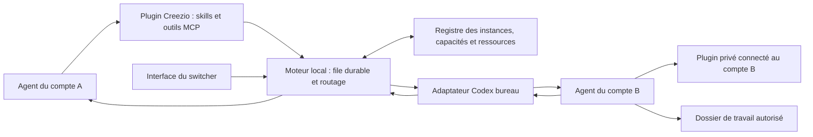

# Audit et plan d’évolution du relais Creezio

Audit du 2 octobre 2026, sur la version 0.4.0-beta.1, commit `52b0785`.
Ce document décrit des évolutions proposées. Il ne constitue pas une nouvelle
version livrée, une installation de plugin ou une activation de tâches automatiques.
L'implémentation postérieure et ses preuves sont dans [IMPLEMENTATION.md](IMPLEMENTATION.md).

## Conclusion

Le relais peut devenir un système local de délégation entre comptes : développement,
revue, tests, consultation d’un plugin privé, puis publication par le propriétaire.
La transmission de messages existe déjà. Les éléments principaux à ajouter sont
l’intégration dans Codex, le suivi durable des tâches et le choix d’un destinataire
selon ses accès réels.

Installer des skills au démarrage du switcher est faisable. La solution recommandée
est un plugin Creezio qui regroupe les skills et un serveur MCP local. Les skills
expliquent quand et comment déléguer ; les outils MCP soumettent et suivent les
tâches ; un moteur local conserve leur état et dialogue avec les instances.

Le compte destinataire utilise ses propres connexions pour exécuter la mission.
Le résultat peut revenir au demandeur sans lui donner les identifiants ni les droits
du destinataire. La disponibilité d’un plugin ne prouve cependant pas l’accès à une
ressource précise ; cette distinction doit guider le routage.

## 1. Ce qui est établi

L’audit repose sur le code et la documentation du dépôt, les commandes d’aide du
Codex installé et les références officielles citées plus bas. Aucune installation,
publication ni modification d’une instance active n’a été effectuée pendant cet audit.

La recette précédente a validé le parcours suivant : A possède un Site privé,
B reçoit un refus d’accès à ce Site, B modifie les fichiers locaux, A publie la
nouvelle version sur le même projet, la réponse revient à B et un accusé rejoint A.
Les 100 tests hors ligne consignés dans la validation précédente n’ont pas été
relancés pour cet audit documentaire. Ce test ne démontre pas encore la compatibilité
avec tous les plugins privés, ni le fonctionnement sans fenêtre Codex.

Technologies actuelles : C# et Windows Forms, .NET Framework 4.8, fichiers chiffrés
avec DPAPI pour l’utilisateur Windows, protocole JSON et canal nommé Windows.
L’adaptateur appelle les outils de conversation internes du bureau Codex. Cette
interface reste sensible aux mises à jour de Codex.

Les commandes `plugin add`, `plugin marketplace add`, `mcp add` et `app-server`
existent dans le CLI local 0.158.0-alpha.2.1. Cela établit leur disponibilité, pas
encore leur bon fonctionnement dans tous les profils isolés du switcher.

## 2. Audit des limites

« Direct » signifie réalisable dans notre code. « À qualifier » signifie qu’un
prototype doit d’abord vérifier le comportement du Codex installé.

| Limite constatée | Évolution proposée | Faisabilité et réserve |
|---|---|---|
| L’agent doit connaître le chemin de l’exécutable et composer du JSON. | Plugin intégré : skills de délégation et outils MCP nommés et documentés. | Direct pour le plugin ; installation par profil et contexte du chat à qualifier. |
| La consigne commune contient une instruction Sites. | Demande générique, avec des modules spécialisés facultatifs pour publication, revue, tests ou plugin privé. | Direct. Le transport transmet déjà du texte général. |
| La connexion nécessite une conversation de référence, un dossier et une commande manuelle. | Assistant de configuration initiale puis enregistrement et diagnostic automatiques. | À qualifier : identifier avec certitude le chat appelant dans un serveur MCP durable. |
| Un redémarrage invalide le processus et le canal enregistrés. | Identité logique stable, nouvelle connexion vérifiée et reprise des conversations connues. | Partiellement préparé : le lanceur détecte déjà le canal des instances qu’il gère. |
| Le suivi périodique appartient à la fenêtre du switcher. | Moteur local distinct, avec démarrage/arrêt explicites et interface cliente. | Direct. PC éteint ou en veille : aucune exécution locale. |
| Le départ d’une demande attend aussi une source ouverte. | Valider l’origine à l’admission, conserver cette preuve, exécuter si possible puis différer le retour. | Direct pour les demandes admises ; nouvelle demande non authentifiée refusée. |
| La destination est choisie manuellement ; ses plugins ne sont pas inventoriés. | Registre des capacités, ressources et règles de routage, avec vérification dans le chat destinataire. | À qualifier pour l’inventaire ; règles locales réalisables directement. |
| Un compte avec davantage de quota n’a pas forcément les bons droits. | Filtrer d’abord par droits et capacités, puis classer selon disponibilité et limites d’utilisation. | Direct. Une ressource réservée reste attachée à ses comptes autorisés. |
| Les permissions sont déduites du dernier contexte enregistré dans les journaux. | Diagnostic par conversation et prérequis adaptés au travail : lecture, écriture du projet ou accès complet. | Lecture effective par API à qualifier ; conserver le contrôle prudent si elle manque. |
| Les chats créés sont sans projet enregistré ; le dossier est indiqué dans le prompt. | Créer la tâche dans le projet local approprié, vérifier son dossier effectif et sa révision. | À qualifier dans l’adaptateur bureau ; ne pas confondre le projet Codex et le projet Sites. |
| Un verrou global est conservé pendant les appels à Codex. | Verrouiller brièvement les changements d’état, puis appeler les instances séparément. | Direct ; nécessite des tests de concurrence et de panne. |
| Les 30 premiers messages actifs sont parcourus séquentiellement. | Ordonnancement équitable par instance, priorité et prochaine échéance. | Direct ; éviter qu’une tâche lente retarde tous les canaux. |
| Chaque lecture de la liste recharge les fichiers de messages. | Index des tâches actives, pagination de l’historique, reconstruction contrôlée. | Direct ; garder DPAPI initialement, évaluer une base seulement si les mesures le justifient. |
| La réponse est cherchée dans les huit derniers tours, avec une taille bornée. | Lecture avec curseur, résultats structurés et fichiers de résultat référencés par empreinte. | Pagination à qualifier selon l’adaptateur ; ne pas traiter une réponse tronquée comme complète. |
| Une fin de conversation vaut actuellement réception d’un texte final. | Séparer transport, exécution, succès métier et remise du résultat. | Direct ; certaines actions nécessitent une preuve externe. |
| Un échec ou une interruption du destinataire n’est pas renvoyé par la branche normale de retour. | Retour systématique des succès, échecs, annulations et blocages pertinents. | Direct et prioritaire. |
| Un envoi interrompu passe à « issue inconnue », avec vérification manuelle. | Journal d’envoi, identifiants de corrélation, recherche de la tâche distante avant toute reprise. | Amélioration forte possible ; aucune garantie universelle d’exécution exactement une fois. |
| L’annulation ne concerne que les demandes encore en file. | Demander l’interruption du tour concerné et attendre sa confirmation. | À qualifier ; ne pas fermer toute l’instance et ne pas prétendre annuler un effet déjà publié. |
| Plusieurs canaux peuvent écrire dans le même checkout. | Accès exclusif aux écritures et aux publications ; worktrees réutilisables lorsque plusieurs auteurs sont nécessaires. | Direct côté relais ; un éditeur externe reste hors de ses verrous. |
| Aucun suivi parent/enfants, dépendances ou limite d’échanges n’existe. | Groupes de tâches, dépendances, agrégation des résultats, plafonds de durée, concurrence et profondeur. | Direct, après fiabilisation du moteur. |
| Les profils partagent le même utilisateur Windows. | Cloisonnement fonctionnel, données minimales et règles par projet ; isolation Windows distincte en option séparée. | Les règles applicatives et DPAPI ne sont pas une frontière de sécurité entre ces agents. |
| Les prompts et réponses passent par les conversations Codex. | Réduire leur contenu, transmettre des références et conserver les pièces volumineuses localement. | Le relais reste local ; le traitement habituel de Codex ne devient pas entièrement local. |
| Le protocole bureau est interne. | Adaptateurs versionnés, diagnostic de compatibilité et tests avant activation d’une nouvelle version. | Risque durable. Un plugin officiel ne stabilise pas à lui seul ce transport interne. |

Ces constats sont notamment visibles dans
[le moteur du relais](https://github.com/creezio/codex-account-switcher-windows/blob/52b07858c0e8ca3056460d8588064a0f99fb094b/src/RelayEngine.cs),
[son stockage](https://github.com/creezio/codex-account-switcher-windows/blob/52b07858c0e8ca3056460d8588064a0f99fb094b/src/RelayStore.cs),
[le contrôle des permissions](https://github.com/creezio/codex-account-switcher-windows/blob/52b07858c0e8ca3056460d8588064a0f99fb094b/src/RelayPermissions.cs)
et [le minuteur de l’interface](https://github.com/creezio/codex-account-switcher-windows/blob/52b07858c0e8ca3056460d8588064a0f99fb094b/src/MainForm.cs#L88).

## 3. Architecture proposée

La distribution garderait une interface WinForms légère et ajouterait deux rôles
séparés : un processus de coordination par utilisateur Windows et un adaptateur MCP
local par profil Codex. Ils pourraient partager un binaire et des bibliothèques.
Le MVP utiliserait MCP sur entrée/sortie standard et des canaux Windows locaux entre
ses composants ; aucun serveur Internet supplémentaire n’est nécessaire.

Le moteur serait l’unique responsable de l’ordonnancement. L’interface, le CLI de
compatibilité et le MCP lui adresseraient les mêmes opérations. Il ne faut pas
conserver trois boucles concurrentes qui exécuteraient chacune les demandes.

Le SDK C# officiel de MCP inclut une cible .NET Standard 2.0. Un prototype doit
vérifier son intégration et ses dépendances avec notre application .NET Framework
4.8, actuellement compilée sans NuGet. Une version testée serait épinglée ; une
migration globale de l’interface n’est pas un prérequis.
[Source du SDK C#](https://github.com/modelcontextprotocol/csharp-sdk/blob/main/src/ModelContextProtocol/ModelContextProtocol.csproj).

Deux adaptateurs d’exécution seraient distingués : le bureau, déjà éprouvé pour
Sites, et éventuellement `app-server` pour des tâches sans interface. L’équivalence
des connexions aux plugins privés entre ces deux environnements reste à démontrer.
Le second ne doit pas être choisi automatiquement pour une tâche dont les capacités
n’y sont pas vérifiées.

## 4. Installation intégrée et utilisation par les agents

Au lancement du switcher ou à la création d’une instance, l’installateur proposé :

1. Identifie les profils gérés, la version de Codex et l’intégration déjà installée.
2. Compare version et empreinte du plugin embarqué avec l’état installé.
3. Installe ou met à jour uniquement l’intégration Creezio dans les profils activés,
   par les commandes prévues par Codex. Conserve les autres configurations.
4. Vérifie le chargement des skills et des outils ; affiche « prêt », « désactivé »,
   « incompatible » ou « nouvelle conversation nécessaire ».
5. Enregistre une connexion vérifiable avec l’identité de l’instance. Un redémarrage
   du switcher ne réinstalle pas tout et ne réactive pas un plugin désactivé volontairement.

La distribution par plugin permet de regrouper skills et MCP, avec installation
depuis une marketplace locale. Il faut tenir compte du cache installé et du format
de manifeste reconnu par la version du client.
[Documentation des plugins](https://developers.openai.com/plugins/build/plugins).

Deux skills suffisent au départ : **déléguer une tâche** et **exécuter une tâche
relayée**. Ils décrivent les conditions d’utilisation, l’identification du projet,
les informations à envoyer, le traitement d’un résultat et les limites du mandat.
La sélection implicite d’un skill dépend du modèle et de sa description ; elle
n’est pas garantie. Une invocation explicite doit donc rester disponible.
[Documentation des skills](https://learn.chatgpt.com/docs/build-skills).

Le MCP expose des outils proposés tels que `list_agents`, `submit_job`, `get_job`,
`wait_job`, `reply_job` et `cancel_job`. `submit_job` rend rapidement un identifiant ;
`wait_job` attend pendant une durée bornée. Le résultat durable reste consultable
après une coupure. Les instructions d’initialisation du MCP peuvent compléter le
skill pour présenter le parcours commun.
[Configuration MCP](https://learn.chatgpt.com/docs/extend/mcp?surface=cli).

Point bloquant à tester : un serveur MCP peut vivre plus longtemps qu’une
conversation. Une variable d’environnement seule ne prouve donc pas le chat qui
appelle un outil. L’intégration doit lier chaque demande à un contexte vérifiable
fourni par Codex ou à une inscription préalable contrôlée. Elle ne doit jamais
deviner le dernier chat ouvert ni accepter un identifiant fourni par le modèle
comme preuve suffisante.

Autre point à tester : des profils avec des `CODEX_HOME` distincts peuvent partager
des répertoires utilisateur `.agents`. Le périmètre réel des skills doit être
mesuré. L’identité, l’activation et les droits du relais ne doivent pas dépendre
de l’hypothèse que ces répertoires sont privés à chaque instance.

Les conversations existantes sont conservées. Une nouvelle conversation sert à
valider l’intégration si le rechargement n’est pas fiable. Les hooks de démarrage
ne sont pas nécessaires au MVP ; ils impliquent des contraintes de confiance et
de compatibilité supplémentaires.

## 5. Routage général et plugins privés

Le registre doit distinguer quatre objets :

- **Compte** : identité, limites d’utilisation communes à ses instances, connexions.
- **Instance** : profil local, processus, adaptateur, état et capacité de concurrence.
- **Profil d’agent** : rôle, modèle, projets acceptés, types de tâches et permissions.
- **Ressource** : Site, dépôt, espace privé ou autre objet, avec comptes autorisés
  et opérations permises. Les identifiants externes restent stables.

Une capacité comporte une origine de preuve, une date de vérification et un état :
déclarée, détectée, vérifiée, indisponible ou inconnue. L’inventaire s’invalide lors
d’un changement de compte ou d’une erreur d’authentification.

L’API documente `app/installed` pour l’état utilisable des apps et
`mcpServerStatus/list` pour les serveurs et outils MCP. Ces données ne garantissent
pas l’accès à un Site ou à un dossier privé particulier. Leur disponibilité dans
l’adaptateur bureau doit être vérifiée. Les méthodes `plugin/list` et
`plugin/install` y sont signalées comme en développement : elles ne constituent
pas la base proposée pour l’installateur de production.
[Référence App Server](https://learn.chatgpt.com/docs/app-server).

Le routage applique cet ordre : projet et mandat autorisés → ressource accessible
→ outils utilisables → permissions adéquates → instance disponible → limites
d’utilisation suffisamment fraîches → priorité et charge. Il expose les raisons
de son choix ou de son attente. Un destinataire explicite reste possible.

Un plugin privé reste installé et connecté au compte qui y a accès. Ce compte
effectue l’action et retourne uniquement les informations utiles au mandat. Les
secrets de connexion ne circulent pas. L’accès à une donnée privée n’autorise pas
automatiquement sa diffusion dans une autre conversation : le périmètre de retour
fait partie du profil et de la tâche.

Si le seul propriétaire disponible n’a plus de quota, la tâche attend. La politique
existante de réinitialisation des limites peut être sollicitée si elle est activée
et applicable, puis les quotas sont relus. Plusieurs instances du même compte ne
multiplient pas ses quotas ni ses réinitialisations. Le solde de crédits payants
reste un indicateur distinct ; aucun achat ou changement de compte actif n’est
impliqué par le routage.

Exemple de parcours : un agent développe une modification ; un autre relit le diff ;
un troisième consulte un plugin métier privé ; après les corrections, le compte
propriétaire publie la version identifiée. Les résultats convergent vers la
conversation d’origine. Les dépendances empêchent une publication avant validation.

## 6. Contrat de tâche, réponses et reprise

Une tâche porterait au minimum : identifiant et clé de dédoublonnage, parent éventuel,
conversation source vérifiée, projet, objectif, capacités requises, ressource cible,
révision ou empreintes, permissions nécessaires, délai, politique de retour et
référence au mandat utilisateur. L’agent peut proposer ces paramètres ; le moteur
contrôle leur cohérence avec les règles configurées.

Le résultat distingue : `succeeded`, `failed`, `blocked` ou `cancelled`, résumé,
erreur exploitable, fichiers produits, empreintes et preuves disponibles. Par
exemple, une publication réussie fournit l’identifiant du déploiement confirmé,
la version et l’URL. Une phrase de l’agent indiquant « publié » ne suffit pas lorsque
le connecteur fournit une confirmation vérifiable.

Les étapes de livraison sont enregistrées séparément : demande acceptée par le
relais, message remis à Codex, exécution observée, résultat obtenu, résultat remis
à la source, accusé éventuel. L’absence d’accusé ne doit pas provoquer une nouvelle
publication. Un état « bloqué par approbation », « connexion expirée » ou « quota
insuffisant » doit être visible sans devenir une erreur générique.

La reprise repose sur une file persistante, un journal d’envoi et une recherche
du travail distant avant tout nouvel envoi. Des baux limités et renouvelables
empêchent deux moteurs de prendre la même tâche après une panne. Les effets
externes ont leurs propres clés et vérifications lorsque le fournisseur les
permet. Si le résultat reste indéterminable, l’état « à vérifier » demeure : aucun
relais ne peut garantir exactement une exécution pour toute action externe.

Les retours disposent d’une file indépendante de celle des nouveaux travaux :
un agent qui attend une réponse ne doit pas bloquer cette réponse. Limiter le
nombre de sous-tâches, la profondeur de délégation, la durée et les relances évite
les échanges sans fin. Les plafonds de consommation exacte dépendront des données
réellement disponibles ; les quotas affichés ne constituent pas un budget monétaire.

## 7. Fichiers, permissions et espace disque

Un projet logique référence un ou plusieurs chemins locaux autorisés et une version
attendue. Deux instances qui utilisent le même chemin voient les mêmes fichiers.
Pour une lecture ou une publication, le moteur vérifie les empreintes avant remise
au destinataire. Une modification concurrente impose une nouvelle validation ; la
simple présence d’un SHA dans le prompt ne verrouille pas les fichiers.

Les publications prennent un verrou par ressource externe, même si elles viennent
de canaux différents. Les modifications prennent un verrou de travail ou un
worktree disponible. Les agents chargés d’écrire en parallèle reçoivent des espaces
distincts puis intègrent leurs modifications avec détection des conflits.

Réutiliser les checkouts, worktrees et dépendances ; limiter le nombre d’espaces
simultanés ; vérifier l’espace avant une opération volumineuse. Le poste était
sous le seuil utilisateur de 20 Gio libres lors de l’audit. Les essais futurs
doivent privilégier les builds existants et de petits projets. Le nettoyage doit
préserver sources, données, historiques et livrables, vérifier les processus et
chemins, et ne jamais traverser une jonction pour supprimer des fichiers.

Le profil d’exécution doit respecter le choix de l’utilisateur pour la conversation.
Le moteur peut prévenir un décalage, sélectionner un profil déjà autorisé ou afficher
un blocage ; il ne doit pas approuver une boîte de dialogue à la place de l’utilisateur.
Les règles d’approbation d’un plugin peuvent rester distinctes de l’accès complet
aux commandes locales. Une demande relayée ne peut pas étendre son propre mandat.

Les profils sous le même compte Windows ont accès aux mêmes droits système. DPAPI
protège le stockage au repos dans ce périmètre, pas contre un autre processus de
ce même utilisateur. Une isolation forte nécessiterait une conception distincte
avec utilisateurs Windows séparés ou machines virtuelles, et partage de fichiers
contrôlé. Ce n’est pas le périmètre du MVP.

## 8. Évolution de l’interface

Conserver les vues Comptes et Instances, puis faire évoluer Relais vers une vue
Travaux. Une instance affiche son compte actuel, son rôle, ses tâches, ses capacités
vérifiées et l’état du plugin Creezio. Distinguer une instance simplement ouverte
d’une instance réellement prête à recevoir une tâche.

La vue Projets associe dossiers, agents autorisés et ressources externes. Elle
permet de désigner le propriétaire d’une ressource et les types de tâches
délégables. Ces règles rendent le mandat réutilisable sans confirmation répétée
pour chaque opération déjà autorisée. Une nouvelle action hors de ce périmètre
reste à traiter explicitement.

La vue Travaux présente la file, les dépendances, le compte sélectionné et la raison
de ce choix. Chaque tâche montre sa progression, son résultat, ses preuves et les
liens vers les conversations. Les commandes proposées sont précises : consulter,
continuer l’échange, interrompre, vérifier une issue inconnue ou reprendre après
résolution du blocage. « Réessayer » ne doit pas masquer un renvoi potentiellement
dupliqué.

Un diagnostic rassemble versions, disponibilité des outils, droits du chat et
dernière erreur, sans afficher de jetons. Les réglages distinguent fermeture de
l’interface et arrêt du moteur. Le lancement à l’ouverture de Windows serait une
option effectivement configurée et testée, jamais une surveillance implicite.

## 9. Plan de livraison et critères d’acceptation

Les versions ci-dessous sont des jalons proposés, pas des dates promises.

| Lot | Contenu | Validation exigée avant livraison |
|---|---|---|
| 0 — Qualification | Installation locale par profil, contexte du chat MCP, inventaire des capacités, reconnexion, compatibilité du SDK. | Dans deux profils de test existants : origine et compte corrects, plugin détecté, aucun changement dans le chat principal ; limites des interfaces consignées. |
| 1 — v0.5, usage intégré | Moteur unique séparé de la fenêtre, plugin et outils MCP, tâches génériques, contrat de résultat, remontée des échecs. | Une tâche de revue et une tâche de test vont de A à B et reviennent sans commande manuelle ; fermeture de l’interface sans perte de suivi ; installation répétée sans doublon. |
| 2 — v0.6, continuité | Reconnexion vérifiée, file de retours différés, journal de reprise, équité entre canaux, lecture longue et annulation ciblée si disponible. | Coupure avant et après envoi, redémarrage du destinataire, source fermée puis rouverte ; pas de republication en cas d’issue inconnue ; un canal lent ne bloque pas les autres. |
| 3 — v0.7, accès et routage | Registre des plugins et ressources, profils d’agents, destination automatique expliquée, gestion des limites par compte. | Tâche générale vers un agent disponible, tâche privée vers le seul compte capable, publication vers le propriétaire ; refus d’accès et connexion expirée correctement affichés. |
| 4 — v0.8, travaux coordonnés | Dépendances, plusieurs tâches parallèles, synthèse, verrous de fichiers et ressources, limites de délégation. | Deux auteurs ne s’écrasent pas ; revue sur la bonne révision ; une dépendance échouée bloque la publication ; arrêt sans fermer les instances utilisateur. |
| 5 — v1, exploitation | Diagnostic, compatibilité de versions, migration et retour arrière, historique paginé, documentation et distribution reproductible. | Migration d’une copie minimale des données de test v0.4 ; historique préservé ; panne de mise à jour récupérable ; aucune accumulation de builds et dépendances inutiles. |

Le lot 0 décide des mécanismes exacts. Si le contexte appelant n’est pas fourni au
MCP, conserver une connexion explicite par conversation. Si l’inventaire automatique
n’est pas accessible, commencer par des capacités déclarées puis vérifiées par
des sondes de lecture. Si l’exécution sans fenêtre n’a pas les plugins nécessaires,
conserver le bureau pour ces tâches. Ces restrictions doivent être visibles.

La recette finale devra couvrir trois usages distincts : développement/revue,
action avec plugin privé, publication sur une ressource existante. Ajouter les cas
de permissions différentes, réponse longue, compte changé, quota épuisé, tentative
dupliquée, panne au moment du retour et configuration du plugin désactivée.

Le premier objectif produit est simple : depuis un chat normal, demander un travail
à un agent compatible, suivre son état et recevoir son résultat au bon endroit.
Les groupes de tâches et l’exécution sans interface viennent après la preuve de
ce parcours sur plusieurs comptes.
